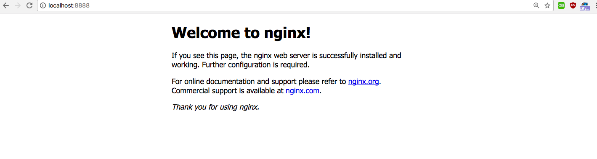
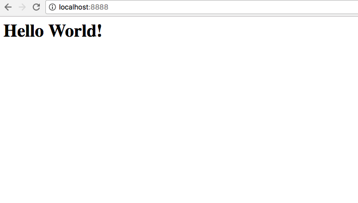
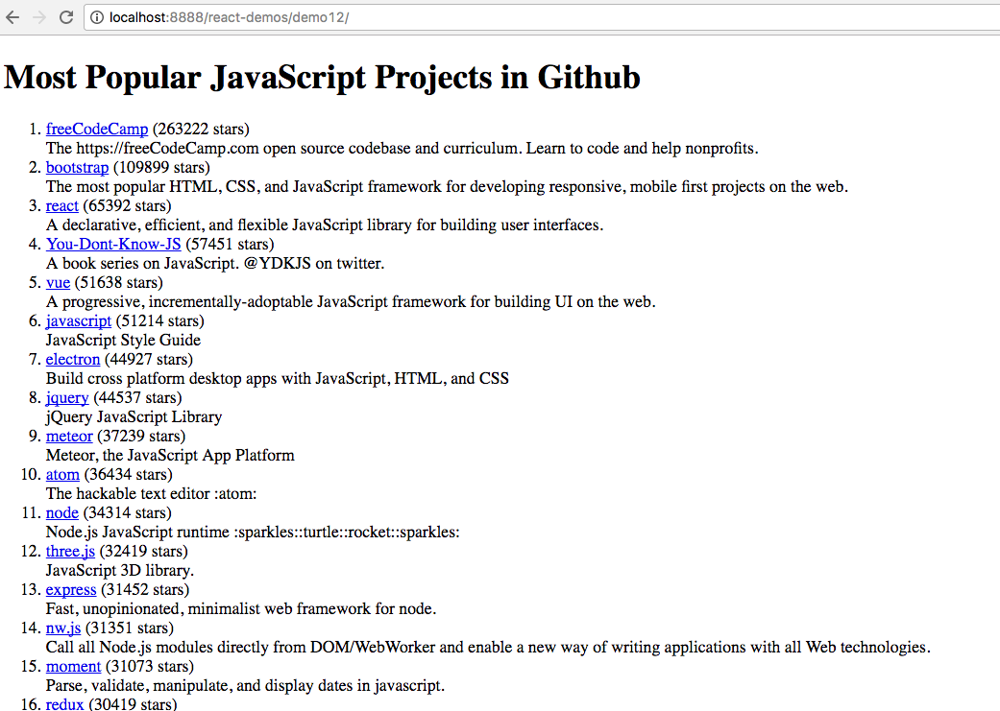

__Serve a Rich Web Appplication with Docker__
=============================================

__Table of Contents__
=====================

* [<strong>Serve a Rich Web Appplication with Docker</strong>](#serve-a-rich-web-appplication-with-docker)
      * [Goal of this Lesson](#goal-of-this-lesson)
      * [Before We Start](#before-we-start)
      * [Pull An Image From DockerHub](#pull-an-image-from-dockerhub)
      * [Search and Destroy](#search-and-destroy)
      * [Routing Ports](#routing-ports)
         * [Nginx Homepage](#nginx-homepage)
      * [Go Inside](#go-inside)
         * [Your First Website](#your-first-website)
      * [Lets Run Random Code from the Internet!](#lets-run-random-code-from-the-internet)
         * [Some React Demos](#some-react-demos)
      * [You Can't Break It](#you-cant-break-it)
      * [Get Assets Out of the Box](#get-assets-out-of-the-box)
      * [Docker's Little Helper](#dockers-little-helper)
      * [The End... or is it?](#the-end-or-is-it)

## Goal of this Lesson
In this lesson we are going to show you the very basics that are needed to run any Docker container. This includes
routing ports so the container is accessible, getting assets out of a container, mounting your own local assets into a
container, and a little bash script to help manage starting, stopping and building.

We will be working with the official Nginx web server image and by the end of this tutorial you'll be able to serve
your own content from the web server container.

## Before We Start
This tutorial assumes you've installed Docker on your system of choice. If you haven't done that, check out
**[Section 2 - Docker Installation.](../2-Docker_Installation)**. If you do have Docker installed lets get started!

## Pull An Image From DockerHub
Lets get a docker image from the DockerHub registry for the nginx web server and get the latest image.

```bash
$ docker pull nginx:latest
Using default tag: latest
latest: Pulling from library/nginx
36a46ebd5019: Downloading [==============================================>    ]   21.6MB/23.28MB
57168433389f: Downloading [==========================================>        ]  18.35MB/21.53MB
332ec8285c50: Download complete
```

List your availible docker images.

```bash
$ docker images
REPOSITORY      TAG     IMAGE ID            CREATED             SIZE
nginx           latest  46102226f2fd        34 hours ago        109MB
```

This pulls a container from the DockerHub (https://hub.docker.com/) registry by name and saves it to your local
registry for running the container.

```bash
$ docker run -d nginx
```

The -d flag will run the docker container as a daemon, or in the background. You won't get the output of the running
container in your terminal, but you'll be able to type other commands here.

## Search and Destroy
Lets look at the stats on our running docker container.

```bash
$ docker ps

CONTAINER ID    IMAGE       COMMAND                  CREATED              STATUS              PORTS     NAMES
60cb92ee7db4    nginx       "nginx -g 'daemon ..."   About a minute ago   Up About a minute   80/tcp    angry_mayer
```

Now your docker container is running! You'll notice if you go to http://localhost that it doesn't show up. Notice your
container name under NAMES. We can stop our container either by the CONTAINER_ID or NAME.

```bash
$ docker stop angry_mayer
angry_mayer
```

## Routing Ports
Now we'll run the container again, but this time expose our docker container port 80 to port 8888.

```bash
$ docker run -d -p 8888:80 nginx

$ docker ps
CONTAINER ID    IMAGE   COMMAND                  CREATED             STATUS         PORTS                  NAMES
55a4e38ca9c9    nginx   "nginx -g 'daemon ..."   10 seconds ago      Up 9 seconds   0.0.0.0:8888->80/tcp   wizardly_bohr
```

We can see from the ports section that we are now forwarding and exposing the docker container port. Lets browse to
http://localhost:8888. Now you have a running web server! But what about content? How do we get it in there?

### Nginx Homepage



## Go Inside
Lets get inside the running container and poke around. We will use a couple new flags -`i (Keep STDIN open even if not
attached)` and `-t (Allocate a pseudo-tty)` as well as a new command `exec` which will execute a command inside the
container. To get a terminal we'll run `/bin/bash`. Like with stop, you can reference the CONTAINER_ID or the NAME.

```bash
$ docker exec -it wizardly_bohr /bin/bash
root@418c3747e687:/# ls -la
total 56
drwxr-xr-x   1 root root 4096 Apr 27 04:04 .
drwxr-xr-x   1 root root 4096 Apr 27 04:04 ..
-rwxr-xr-x   1 root root    0 Apr 27 04:04 .dockerenv
lrwxrwxrwx   1 root root    7 Apr 24 17:02 bin -> usr/bin
drwxr-xr-x   2 root root 4096 Apr  4 16:00 boot
drwxr-xr-x   5 root root  340 Apr 27 04:04 dev
drwxr-xr-x   1 root root 4096 Apr 27 04:04 etc
drwxr-xr-x   2 root root 4096 Apr  4 16:00 home
lrwxrwxrwx   1 root root    7 Apr 24 17:02 lib -> usr/lib
lrwxrwxrwx   1 root root    9 Apr 24 17:02 lib32 -> usr/lib32
lrwxrwxrwx   1 root root    9 Apr 24 17:02 lib64 -> usr/lib64
lrwxrwxrwx   1 root root   10 Apr 24 17:02 libx32 -> usr/libx32
drwxr-xr-x   2 root root 4096 Apr 24 17:02 media
drwxr-xr-x   2 root root 4096 Apr 24 17:02 mnt
drwxr-xr-x   2 root root 4096 Apr 24 17:02 opt
dr-xr-xr-x 135 root root    0 Apr 27 04:04 proc
drwx------   2 root root 4096 Apr 24 17:02 root
drwxr-xr-x   1 root root 4096 Apr 27 04:04 run
lrwxrwxrwx   1 root root    8 Apr 24 17:02 sbin -> usr/sbin
drwxr-xr-x   2 root root 4096 Apr 24 17:02 srv
dr-xr-xr-x  13 root root    0 Apr 27 04:04 sys
drwxrwxrwt   1 root root 4096 Apr 25 17:20 tmp
drwxr-xr-x   1 root root 4096 Apr 25 17:20 usr
drwxr-xr-x   1 root root 4096 Apr 25 17:20 var
```

Since we have bash, we can do most of the things we'd be able to do in a regular linux terminal. Where is our site index?

```bash
root@418c3747e687:/# find / -name index.html
/usr/share/nginx/html/index.html
```

We can replace the index content easily. Don't be afraid of breaking anything. When you stop the container it will go
back to it's original state.

```bash
echo '<h1>Hello World!</h1>' > /usr/share/nginx/html/index.html
```

Now go refresh http://localhost:8888 and see your lovely new website!

### Your First Website


Docker containers can be any flavor of linux out there. You can figure out what kind of system you're using by looking
at the Dockerhub page, the source from github, and the details of the docker file. We'll get more into that later, but
for now lets just do this.

```bash
$ uname -r
4.9.19-moby
```

Moby is the new LinuxKit (https://blog.docker.com/2017/04/introducing-linuxkit-container-os-toolkit) Docker compiled
distro. You could also see ubuntu, or alpine, or RHEL. Lets get some tools, how about git?

```bash
root@418c3747e687:/# apt-get update && apt install -y git
Get:1 http://deb.debian.org/debian stretch InRelease [186 kB]
Get:2 http://security.debian.org stretch/updates InRelease [62.9 kB]
Get:3 http://nginx.org/packages/mainline/debian stretch InRelease [2848 B]
Get:4 http://deb.debian.org/debian stretch-updates InRelease [88.5 kB]
....
Updating certificates in /etc/ssl/certs...
0 added, 0 removed; done.
Running hooks in /etc/ca-certificates/update.d...
done.
```

## Lets Run Random Code from the Internet!
Now we can check out this nice collection of React demos and move them into the html directory

```bash
$ git clone https://github.com/ruanyf/react-demos && mv react-demos /usr/share/nginx/html/
$ ls /usr/share/nginx/html/react-demos/
README.md  build  demo01  demo02  demo03  demo04  demo05  demo06  demo07  demo08  demo09  demo10  demo11  demo12  demo13
```

Go check out http://localhost:8888/react-demos/demo12/ or any of the others to see them run! Now you have a fully
functioning web server without any of the system setup hastle! Exit the container and stop it.

### Some React Demos


```bash
root@418c3747e687:/# exit
$ docker stop wizardly_bohr
wizardly_bohr
```

## You Can't Break It
Then start it again just like before and then refresh http://localhost:8888 in your browser.

```bash
$ docker run -d -p 8888:80 nginx
```
Everything is back to the way it was at the start. Now that you know how to set up and run a container,
lets mount a volume so you can put your work in the right place to serve it up from your computer. For this we will use
the volume or -v flag. Stop your running container, this time try using the CONTAINER_ID if you haven't already.

```bash
$ docker run -d -p 8888:80 -v $PWD/src:/usr/share/nginx/html/ nginx
$ cd src
$ echo '<h1>Hello Docker Volumes!</h1>' > index.html
```

Refresh your browser again and now you can see your glorious website hosted from your local code. Now when you destroy
your container, your work is safe on your system.


## Get Assets Out of the Box
Now lets exec back into our container and get our nginx config so we can do a little more customization to our server.

```bash
$ docker exec -it <CONTAINER_ID> /bin/bash
root@82338c189f9e:/# cp /etc/nginx/conf.d/default.conf /usr/share/nginx/html/
root@82338c189f9e:/# cp /etc/nginx/nginx.conf /usr/share/nginx/html/
root@82338c189f9e:/# exit
```

Now you have copied the original configuration files to your mounted volume so you can edit them as you see fit. Lets
make a place to store the nginx config files we want to override.

```bash
$ mkdir -p conf/nginx
$ mv src/*.conf conf/nginx
```

## Docker's Little Helper
To keep things nice and tidy, we can use a bash script to organize our container settings and flags. We will add the new
volume mount points for our script overrides as well.

[**webserver.sh**]
```bash
#!/bin/bash
if [[ "$1" = "start" ]]; then
	echo "Running Nginx Webserver"
	docker run -d \
		-p "8888:80" \
		-v "$PWD/src:/usr/share/nginx/html/" \
		nginx

	NAME=`docker ps | awk '{print $1, $2, $NF}' | grep nginx | awk '{print $NF}'`
	echo $NAME
	echo "Started Container $NAME. Execing Container TTY"
	docker exec -it $NAME /bin/bash
fi

if [[ "$1" = "stop" ]]; then
	echo "Stopping all Docker Containers with image name 'nginx'"
	docker ps | awk '{print $1, $2, $NF}' | grep nginx | awk '{print $NF}' | xargs -I {} docker stop {}
fi

if [[ "$1" = "bash" ]]; then
	NAME=$(docker ps | awk '{print $1, $2, $NF}' | grep nginx | awk '{print $NF}')
        echo $NAME
        echo "Started Container $NAME. Execing Container TTY"
        docker exec -it $NAME /bin/bash
fi
```

Now lets test it out...

```bash
$ chmod +x webserver.sh
$ ./webserver.sh start

Running Nginx Webserver
b46da5a3de1462252d376367b525dc11e655566273ce1b30a97c62b7c3410a2c
Started Container 'lucid_bose.' Execing Container TTY.
root@b46da5a3de14:/# exit

$ ./webserver.sh bash
Found Container 'tender_thompson.' Execing Container TTY.
root@002c039e7436:/# stop

$ .webserver.sh stop
Stopping all 'nginx' Docker Containers.
lucid_bose
```

## The End... or is it?
Bare-bones docker can get to be a lot to manage without well structured file folders. A helping bash script is a good
place to start, but don't worry too much about it. There are other great tools for managing your configuration that
we will get to later. Right now we just want to go over the basics and show you how to interact with docker directly.

Take it to the next level in **[Section 4 - The Dockerfile](../4-The_Dockerfile)**!

