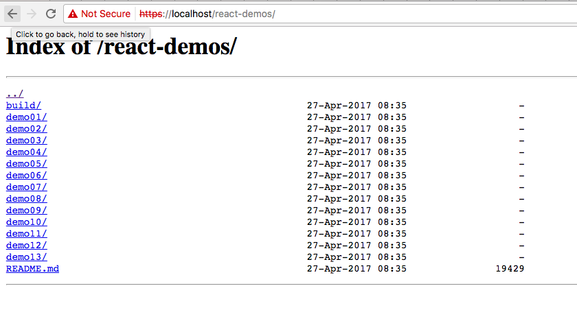
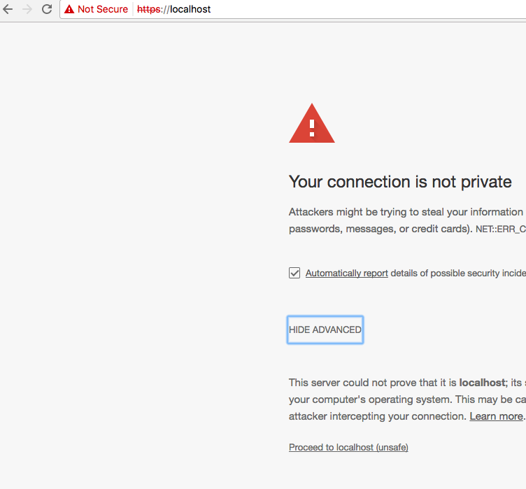

__The Dockerfile__
==================

__Table of Contents__

[TOC]

Now that we know how to run other people's containers and modify their contents for our own needs,
how about we make our own docker container?

## A Stitch in Time
Good organization is key to being able to reuse your Docker kit easily, I'll lay out a file pattern that I use, but
really there is no official way and it can really change a lot depending on your application. Play with it and see what
works for you!

```bash
$ LESSON_ROOT=$PWD/.. # Just a little helper env variable for copying files
$ mkdir -p compose/nginx
$ cd compose/nginx
```

## Our First Monster
We start by making a `Dockerfile`. At the top of all `Dockerfiles` you need to start with `FROM` and the name of either
a local container or one in an availible registry. Docker assembles images by stacking sequential "Artifacts". This makes
it super efficient to store, iterate, and deploy complex systems as you do not have to keep an artifact twice. In general
each line in a `Dockerfile` is stored in the registry (local, or remore) as an artifact layer. So we are going to start
our Image by inheriting from an existing nginx image.

Lets go look at the nginx DockerHub (https://hub.docker.com/r/library/nginx/tags/) and see the availible image tags.
To mix it up, lets specify 1.12.0-alpine. Alpine linux is super lightweight and very well suited for building docker
containers. Official alpine containers are a great resource for best practices. (https://hub.docker.com/r/_/alpine/)

Lets add git to our container so we can grab our react-demos when the container builds. Alpine uses `apk` for package
management not to be confused with Android apk executables. It works very similar to apt, yum, or homebrew. The
--no-cache flag is good practice so you do not leave cached install files and you keep the size of your container to a
minimum. After we use git. We delete the package, again to keep our container size small.

We are also grabbing a repo to generate some self signed SSL certificates for alpine.

We use the `RUN` command to tell the build process to run a command as root on the system.

```bash
$ vim Dockerfile

[Dockerfile]
FROM nginx:1.12.0-alpine

RUN apk update && apk upgrade && \
    apk add --no-cache bash git openssh openssl

RUN git clone https://github.com/ruanyf/react-demos && mv react-demos /usr/share/nginx/html/
RUN cd /tmp && git clone https://github.com/paulczar/omgwtfssl.git certs
RUN apk del git openssh
```

## A Little Navigation
Now lets copy our nginx configs from our previous lesson into our project folder. Then in the Dockerfile we will
`COPY` to copy the configs to their needed location. They can still be overridden at runtime, but now the container will
have our new defaults baked in. We'll also drop in a little custom index so we can easily browse to our content.

```bash
$ cp -r $LESSON_ROOT/3-Running_Your_First_Container/conf .
$ mkdir -p src/html
$ echo "<a href='/react-demos/'>React Demos</a><br>" > src/html/index.html
$ echo "<a href='/app/"'>Local Assets</a><br>" >> src/html/index.html
```

Add these `COPY` commands to copy the nginx configs so our settings are baked into the `IMAGE` as defaults if not
overriden.

[**Dockerfile**]
```Dockerfile
COPY conf/nginx/default.conf /etc/nginx/conf.d/default.conf
COPY conf/nginx/nginx.conf /etc/nginx/nginx.conf
```

We will probably want to allow directory indexes in nginx to make it easier to navigate our source. Add `autoindex on`
to line 11 in your default.conf. Also add a new location of `/app/` so you can tie content from your local system to
that location.

[**default.conf**]
```nginx
...
16 location / {
17      root   /usr/share/nginx/html;
18      index  index.html index.htm;
19      autoindex on;
20  }
21
22  location /app {
23      root /home/src; # This resoles to /home/src/app
24      index  index.html index.htm;
25      autoindex on;
26  }
...
```

### Directory Listing


## WORKDIR, You love it.
It can be very useful to specify a `WORKDIR` for your docker container. This is a directory that your container will
default to when run. So when you execute commands with your container, it will be in the context of that director. For
instance if you `docker exec -it nginx:egghead bash` you will be in your `WORKDIR` automagically. However more usefully, if
you put `somescript.sh` into the `WORKDIR` you can run `docker run nginx:egghead somescript.sh` and that script will be run
in the context of your whole app. This can be very useful for all sorts of automation. Encapsulating the execution of a
script in a completely sandboxed operating environment.

[**Dockerfile**]
```Dockerfile
RUN mkdir -p /home/src/app
WORKDIR /home/src
```

You may have noticed before that the `nginx` image did not have 443 exposed. We will do that now. It's good to keep in
mind that you cannot hide ports from an inherited container. So if you had a container that inherited from this one it
would not be able to close 443, you would have to go back to this container and rebuild. So it's best practice to expose
only the minimum you need. Some deployment patterns with Kubernetes and similar can require operating containers to only
have one exposed port because another system does the network routing. Since this container is our whole system though,
we are going to kick out some SSL.

In the `default.conf` we'll need to add 443 to the availible ports.

[**default.conf**]
```nginx
1  server {
2    listen       80;
3    listen 443 default_server ssl;
4    server_name  localhost;
5
6    ssl on;
7    ssl_certificate /tmp/certs/cert.pem;
8    ssl_certificate_key /tmp/certs/key.pem;
9    ssl_session_timeout 5m;
10    ssl_protocols       TLSv1 TLSv1.1 TLSv1.2;
11    ssl_ciphers         HIGH:!aNULL:!MD5;
12
13    #charset koi8-r;
14    access_log  /var/log/nginx/host.access.log  main;
...
```

Add this `RUN` command to generate-certs with the script we got from omgwtfssl.

[**Dockerfile**]
```Dockerfile
RUN cd /tmp/certs && bash generate-certs
EXPOSE 80 443
```

## Our final Dockerfile

[**Dockerfile**]
```Dockerfile
FROM nginx:1.12.0-alpine

RUN apk update && apk upgrade && \
    apk add --no-cache bash git openssh openssl

RUN git clone https://github.com/ruanyf/react-demos && mv react-demos /usr/share/nginx/html/
RUN cd /tmp && git clone https://github.com/paulczar/omgwtfssl.git certs
RUN apk del git openssh

COPY conf/nginx/default.conf /etc/nginx/conf.d/default.conf
COPY conf/nginx/nginx.conf /etc/nginx/nginx.conf

RUN mkdir -p /home/src/app
RUN cd /usr/share/nginx/html/ && ln -s /home/src/app .

WORKDIR /home/src

RUN cd /tmp/certs && bash generate-certs
EXPOSE 80 443
```

##  Build and Run
Now lets build the thing. The -t is the tag for the container. We specify the context after. In this case `.`

`$ docker build -t <tag> <context>`

```bash
$ docker build -t nginx:egghead .
Sending build context to Docker daemon   12.8kB
Step 1/12 : FROM nginx:1.12.0-alpine
 ---> 61055e9116d4
Step 2/12 : RUN apk update && apk upgrade &&     apk add --no-cache bash git openssh openssl
 ---> Using cache
 ---> 3c0b6c608521
Step 3/12 : RUN git clone https://github.com/ruanyf/react-demos && mv react-demos /usr/share/nginx/html/
 ---> Using cache
 ---> d9141a62fb1d
Step 4/12 : RUN cd /tmp && git clone https://github.com/paulczar/omgwtfssl.git certs
 ---> Using cache
 ---> 485c71be201a
Step 5/12 : RUN apk del git openssh
 ---> Using cache
 ---> 268acd143101
...

...
-----BEGIN CERTIFICATE-----
MIIC5DCCAcygAwIBAgIJALue4vEy9IfQMA0GCSqGSIb3DQEBCwUAMBIxEDAOBgNV
BAMMB3Rlc3QtY2EwHhcNMTcwNDI3MDkwMzI1WhcNMTcwNjI2MDkwMzI1WjAWMRQw
EgYDVQQDDAtleGFtcGxlLmNvbTCCASIwDQYJKoZIhvcNAQEBBQADggEPADCCAQoC
ggEBALIqVu55KM395I9Udwrbm25Ex/md93Qhu6F9L+4g4FN9C6VwN+wFB7vzOYXx
Vz7/w+ffl/Oj0jMEnxHTyBRa9biRDH1H8hwCI9aFzzLNGOFEyCoCbN5xjvXElnvs
st3YziQUSyyFB5hUxeM22DJq4EefCGyRN965en6wnKllABYRBAf2JJ0yGcW7gJ3M
i7hc9JAwI1FApGeeLg6VoDJA3ErNbfnbd0ixOU4B1wAreveJ33WrtPUPEU3LgVVv
lQQMBwX2sYvBtjY2AKuhVE/uw1IWbpzHIrc3p67sIy+IF1LdETrMGs09Wy6ohVnA
Rgnt//2vHGDgNAZWhCjNSelHflECAwEAAaM5MDcwCQYDVR0TBAIwADALBgNVHQ8E
BAMCBeAwHQYDVR0lBBYwFAYIKwYBBQUHAwIGCCsGAQUFBwMBMA0GCSqGSIb3DQEB
CwUAA4IBAQB9eDHofzYLli/0RmWJICxSF9RzcwKKm3icWNZTdKIG91KegfXz8mxg
58FHhIj/r8wwmGGFMbFpSCKzHjH4/fOxrr9U1JseB12yMFzadnsgTVXd0I8K2gdh
gFN6IZLbB5WOP/2Zc75089tWakPSF65v1ZsnKqb7/ar8Gh304wCxAK26cCLZ29UF
MGI95bhH5iXqymdD4HiH5Xoe1bhRmhh6IoNvM5Kgh8lnamPlXbbhPVm9WuibK5lk
0e1QIwp1beO6wk0u+LZ5MZiVJ5YdKHLOttk1nwoYGb8gA08eKxi/tKgHPfS4I3Ut
/Qz8kDlUsTDUBgzwMmEvtV5RHlnSk5A2
-----END CERTIFICATE-----
 ---> ced9dbb5c654
Removing intermediate container 7945ca7c98ba
Step 12/12 : EXPOSE 80 443
 ---> Running in 96ac69f78f03
 ---> abc9345c75c7
Removing intermediate container 96ac69f78f03
Successfully built abc9345c75c7
```

##  Spiffing Up Webserver.sh
Copy `webserver.sh` from the previous lesson and we'll add some new features for our new container.

    $ cp -r $LESSON_ROOT/3-Running_Your_First_Container/webserver.sh .

We've added an IMAGE environment variable so we can easily change out tag. We've opened up and routed port 443. Now the
`/src/` directory is mounted in the `WORKDIR` location and we've added a little helper for building the container.

[**webserver.sh**]
```bash
#!/bin/bash
IMAGE="nginx:egghead"                                                       # <--[** NEW **]

if [[ "$1" = "start" ]]; then
    echo "Running Nginx Container '$IMAGE'"
    docker run -d \
        -p "8888:80" \
        -p "443:443" \                                                      # <--[** NEW **]
        -v "$PWD/src/html/index.html:/usr/share/nginx/html/index.html" \
        -v "$PWD/src/:/home/src/" \                                         # <--[** NEW **]
        -v "$PWD/conf/nginx/default.conf:/etc/nginx/conf.d/default.conf" \
        -v "$PWD/conf/nginx/nginx.conf:/etc/nginx/nginx.conf" \
        $IMAGE                                                              # <--[** NEW **]

    # Some bash magic, breaks down as follows
    # CONTAINER_NAME=<list running containers> | <get CONTAINER_ID, IMAGE, and NAME> | <return only lines that match $IMAGE> | <return only NAME>

    CONTAINER_NAME=`docker ps | awk '{ print $1,$2,$NF }' | grep $IMAGE | awk '{print $NF }'`
    echo "Started Container '$CONTAINER_NAME.' Execing Container TTY."
    docker exec -it $CONTAINER_NAME /bin/bash
fi

if [[ "$1" = "stop" ]]; then
    echo "Stopping all '$IMAGE' Docker Containers."
    docker ps | awk '{ print $1,$2,$NF }' | grep $IMAGE | awk '{print $NF }' | xargs -I {} docker stop {}
fi

if [[ "$1" = "bash" ]]; then
    CONTAINER_NAME=`docker ps | awk '{ print $1,$2,$NF }' | grep $IMAGE | awk '{print $NF }'`
    echo "Found Container '$CONTAINER_NAME.' Execing Container TTY."
    docker exec -it $CONTAINER_NAME /bin/bash
fi

if [[ "$1" = "build" ]]; then               # <--[** NEW **]
    echo "Building Docker Image $IMAGE"     # <--[** NEW **]
    docker build -t $IMAGE .                # <--[** NEW **]
fi                                          # <--[** NEW **]
```

## Fin

###Secure in my Insecurity


Run `$ ./webserver.sh start` and go have a look at https://localhost. You'll have to allow the "unsafe" self signed SSL
certificate. If you click on `React Demos` you can browse the collection of demos from the previous lesson. If you click
`Local Assets` you will be taken to the `./src/app` directory where you can play around with anything you'd like to
serve up! Now you have your own totally deploy-able secure web server!

Up Next **[Section 5 - The Container Registry](../5-The_Container_Registry)**!