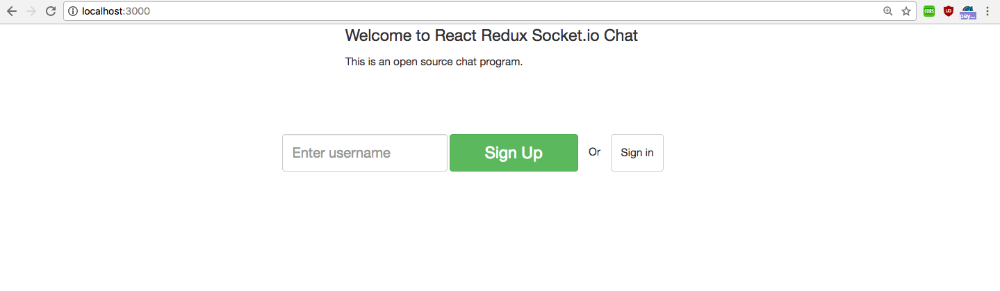
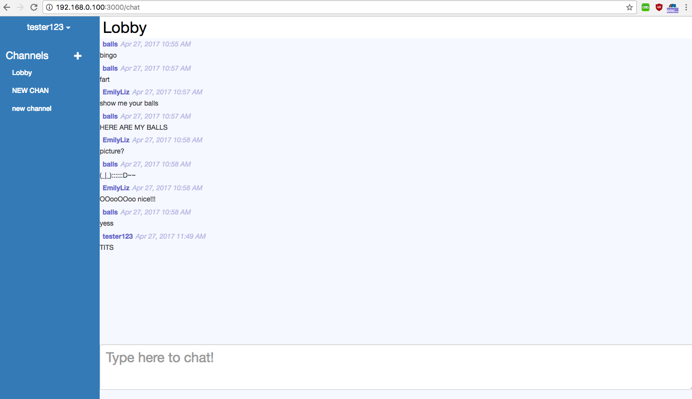
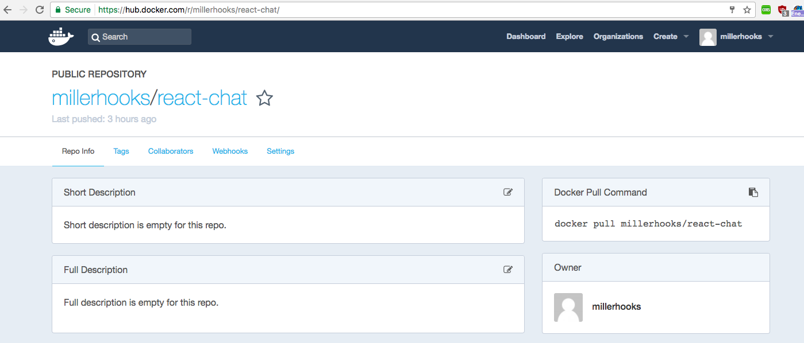

__Container Registry__
======================

__Table of Contents__
---------------------

* [A Stitch in Time](#a-stitch-in-time)
* [Our First Monster](#our-first-monster)
* [A Little Navigation](#a-little-navigation)
  * [Directory Listing](#directory-listing)
* [WORKDIR, You love it.](#workdir-you-love-it)
* [Our final Dockerfile](#our-final-dockerfile)
* [Build and Run](#build-and-run)
* [Spiffing Up Webserver.sh](#spiffing-up-webserversh)
* [Fin](#fin)

## Lesson Objectives
In this lesson we'll address pushing Docker images to DockerHub as well as alternative private registries. To start you
will need an account at https://hub.docker.com. Create an account and we'll get started!

```
$ LESSON_ROOT=$PWD/.. # Just a little helper env variable for copying files
$ cp -r $LESSON_ROOT/4-The_Dockerfile/compose .

$ mkdir -p compose/react-chat && cd compose/react-chat
$ vim Dockerfile
```
##  Let's Make a Slack Clone!
Lets build a `Dockerfile` to serve up a react chat app we found on github that we want to audit. Lets take a look at this
https://github.com/raineroviir/react-redux-socketio-chat.

After reading the README, it looks like it's set up to be run locally. So we'll need to tell it the address of the mongo
server instead of localhost, also for dev we need to replace `localhost` with `0.0.0.0`. If it's limited to localhost,
you won't be able to get to the dev server because it's technically on another computer.

We will be using docker's container linking feature to hook mongo to the chat server. When we do the link the URI
`mongo` will automatically resolve to the MongoDB container from the server container. The mongo container will not be
accessible to any outside computers or services unless they go through the chat container. I'm using `sed` here for
find and replace of the strings I need to edit. But you could just as easily download them and copy them over.

At the bottom of the `Dockerfile`, this time we have set a `CMD`. This is the default command to run when running the
container.

[**Dockerfile**]
```Dockerfile
FROM node:7.9.0-alpine

WORKDIR /home/app

RUN apk update && apk upgrade && \
    apk add --no-cache bash git openssh sed

RUN cd /home && git clone https://github.com/raineroviir/react-redux-socketio-chat.git app

# Set mongo server to mongo instead of localhost to use linked container.
RUN sed -i "s:localhost/chat_dev:mongo/chat_dev:g" /home/app/src/server/server.dev.js
RUN sed -i "s:localhost/chat_dev:mongo/chat_dev:g" /home/app/src/server/server.prod.js

# Set dev server to 0.0.0.0 instead of localhost so it can get out of the container.
RUN sed -i "s:localhost:0.0.0.0:g" /home/app/src/server/server.dev.js

RUN cd /home/app && npm install

RUN apk del git openssh sed

CMD ["npm", "run", "dev"]
```

##  Run it!
Now lets run it! It needs MongoDB to store data, so we'll grab a mongo container and link it. We won't run this
container as a daemon, so you can see the STDOUT from the command.

```bash
$ docker build -t react-chat .

$ docker run --name chat-mongo -d mongo
$ docker run --link chat-mongo:mongo -p "3000:3000" react-chat
```
Browse to http://localhost:3000 and look at your new super cool chat server! It's just like Slack!

### Oooooh


### Aaaaah!


## Make Your Whale Go Paleo
Lets look at our image details.

    $ docker images
    REPOSITORY  TAG         IMAGE ID            CREATED             SIZE
    react-chat  latest      d1fa1d500647        13 minutes ago      262MB
    nginx       egghead     abc9345c75c7        2 hours ago         50.1MB

You might notice here that `react-chat` is pretty large. If you wanted to reduce the file size, you can make a pretty
good argument for doing the `npm install`, when the container launches, before the dev server is started. Something like
this:

[**Dockerfile**]
```Dockerfile
FROM node:7.9.0-alpine

WORKDIR /home/app

RUN apk update && apk upgrade && \
    apk add --no-cache bash git openssh sed

RUN cd /home && git clone https://github.com/raineroviir/react-redux-socketio-chat.git app

# Set mongo server to mongo instead of localhost to use linked container.
RUN sed -i "s:localhost/chat_dev:mongo/chat_dev:g" /home/app/src/server/server.dev.js
RUN sed -i "s:localhost/chat_dev:mongo/chat_dev:g" /home/app/src/server/server.prod.js

# Set dev server to 0.0.0.0 instead of localhost so it can get out of the container.
RUN sed -i "s:localhost:0.0.0.0:g" /home/app/src/server/server.dev.js

#RUN cd /home/app && npm install

RUN apk del git openssh sed

COPY rundev.sh /home/app/rundev.sh
RUN chmod +x /home/app/rundev.sh

CMD ["./rundev.sh"]
```

It's always good to try to get your container down to as little app code and fluff as possible. In production there are
tons of ways to streamline this and I don't think anyone would call this "correct". Always keep sweeping the floors and
you'll have happy containers!

```bash
$ docker images
REPOSITORY      TAG     IMAGE ID            CREATED             SIZE
react-chat      latest  3edf1b7367ca        3 minutes ago       104MB <-- !! Nice !!
```
## Set Them Free
So now you want to share your fancy new containers with your buddies, or you are getting ready to deploy it to AWS or
GKE. First thing we need to log in with our DockerHub account.

```bash
$ docker login
Login with your Docker ID to push and pull images from Docker Hub. If you don't have a Docker ID, head over to https://hub.docker.com to create one.
Username (millerhooks): millerhooks
Password:
Login Succeeded
```

To send our shiny new images to the registry we need to tag them with our DockerID. We'll also give them a version tag.
The version tag isn't required, if it's missing it will default to <IMAGE_NAME>:latest. However in deployment, always
using the latest tag can lead to complications and stale containers. Keeping up with you versioning will save you a lot
of headache!

Replace `millerhooks` with your own DockerID.

```bash
$ docker tag d1fa1d500647 millerhooks/react-chat:0.1
$ docker tag abc9345c75c7 millerhooks/eh-nginx:0.1
```

Now all we have to do is push to the Hub!

```bash
$ docker push millerhooks/react-chat:0.1
The push refers to a repository [docker.io/millerhooks/react-chat]
de232dcc556c: Pushed
53bd8b480bcd: Pushing [===>                                               ]  9.668MB/157.9MB
d290ff29058c: Pushed
6ea6fee57ffc: Pushed
82c72f5963f8: Pushed
59946739f762: Pushing [>                                                  ]  200.7kB/19.56MB
49e2065eec9d: Waiting
434d344a2269: Pushing  2.048kB
91344fba8d31: Waiting
a2b5b00450c7: Waiting
9f8566ee5135: Waiting
91344fba8d31: Mounted from library/node
a2b5b00450c7: Mounted from library/node
9f8566ee5135: Mounted from library/node
```

You can see here how the artifact layers are pulling from the parent so nothing gets stored redundantly. Pretty snazzy.

Lets push up the nginx image too so we can use it easily in our next lesson. This one should be zippy as it's a proper
container not storing a bunch of project assets.

```bash
$ docker push millerhooks/eh-nginx:0.1
The push refers to a repository [docker.io/millerhooks/eh-nginx]
91afc181e15c: Pushed
b767863a54ed: Pushed
5667838554f9: Pushed
d74aa6372d1c: Pushed
43c8aaf53d46: Pushed
260727ea7ab7: Pushed
e5d3cbf6ca4c: Pushed
9e424cd57fb7: Pushing [========================================>          ]  4.966MB/6.065MB
1be7ab7da7e3: Pushing [=====>                                             ]  2.941MB/28.37MB
edaa461c72b3: Waiting
f440fdae4936: Waiting
2d7e2f4c8b06: Waiting
23b9c7b43573: Waiting
```

### Pushed a Thing


## Adios
Now that you've pushed those bastards to the clouds, lets dip our toes into some container orchestration.

See you in **[Section 6 - Container Orchestration](../6-Container_Orchestration)**!