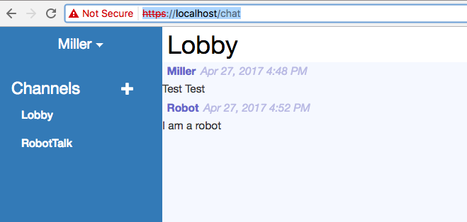
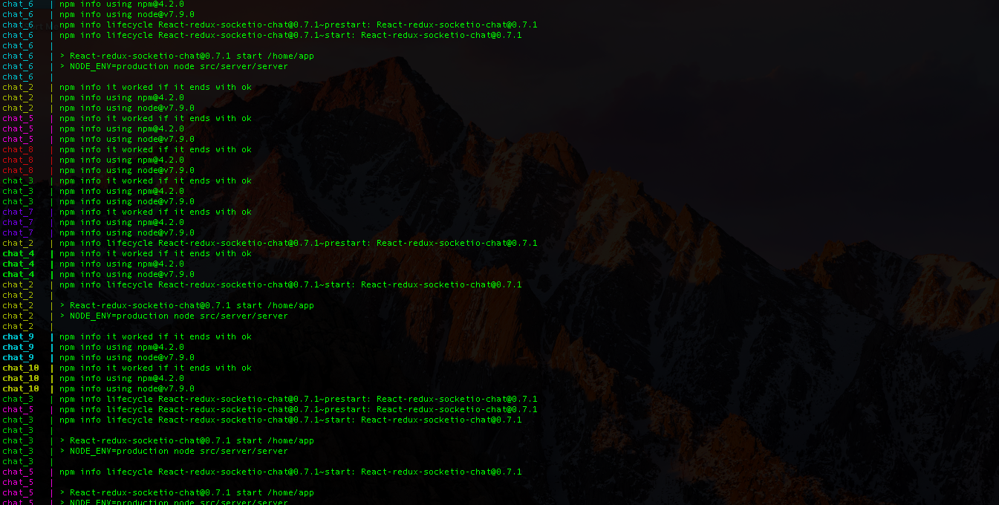

__Container Orchestration__
===========================

__Table of Contents__

[TOC]

## Plucked from the Clouds
I know you've been scared this whole time you'd be trapped in bash land forever. Good news! While a little bash
scripting is essential, docker-compose is here to rescue you. Lets set one up with our images we pushed to DockerHub
and see if we can't roll them into a working production stack.

First thing, lets create the production chat server `Dockerfile`. It's very simple, it inherits from the previous build,
runs the production build scripts, then changess the run command to the production run.

[**compose/react-chat/Dockerfile**]
```Dockerfile
FROM millerhooks/react-chat:0.1

RUN npm install && npm run build
CMD ["npm", "start"]
```

Now lets update the nginx config to upstream to the chat server container. Now our chat server will be routed securely
though nginx!

[**compose/nginx/conf.d/default.conf**]
```nginx
upstream chat {
    server chat:3000;
}

server {
    listen       80;
    listen 443 default_server ssl;
    server_name  localhost;

    ssl on;
    ssl_certificate /tmp/certs/cert.pem;
    ssl_certificate_key /tmp/certs/key.pem;
    ssl_session_timeout 5m;
    ssl_protocols       TLSv1 TLSv1.1 TLSv1.2;
    ssl_ciphers         HIGH:!aNULL:!MD5;

    #charset koi8-r;
    access_log  /var/log/nginx/host.access.log  main;

    location / {
        proxy_pass http://chat;
    }

    #error_page  404              /404.html;

    # redirect server error pages to the static page /50x.html
    #
    error_page   500 502 503 504  /50x.html;
    location = /50x.html {
        root   /usr/share/nginx/html;
    }
}
```

[**docker-compose.yml**]
```yaml
version: '2'
services:
  nginx:
    image: millerhooks/eh-nginx:0.1
    ports:
      - "80:80"
      - "443:443"
    links:
      - chat
    volumes:
      - ./compose/nginx/conf.d:/etc/nginx/conf.d

  chat:
    build: ./compose/react-chat
    depends_on:
      - mongo
    links:
      - mongo
    ports:
      - "3000:3000"

  mongo:
    image: mongo
```

Docker Compose simplifies organization of docker stacks via a comprehensive YAML format.
https://docs.docker.com/compose/compose-file for a complete reference.

Lets go line by line.

* `version: '2'` This specifies the docker-compose file version. Version 2 is the current and is much more feature rich.
* `services:` We put our services stack down here.
* `nginx:` The description of the nginx server.
    * We point it at the image we already compiled and pushed to the registry.
    * Expose posts 80 and 443, just like we did in bash before.
    * `links:` defines the link to containers it will need to access. The same way we did before in bash with MongoDB.
    * `volumes:` Load up the new default.conf nginx config, overloading the one from the image we created.
* `chat-server:`
    * `build:` Instead of an image, we point the service to the location of our Dockerfile.
    * `depends_on:` This makes sure the `mongo` service loads before it does.
    * `ports:` We expose port `3000` but we don't bind it externally to localhost. This way only the nginx server will
    have access to it.

```bash
$ docker-compose build
mongo uses an image, skipping
Building chat-server
Step 1/3 : FROM millerhooks/react-chat:0.1
 ---> d1fa1d500647
Step 2/3 : RUN npm install && npm run build
 ---> Using cache
 ---> 48abc4b17496
Step 3/3 : CMD npm start
 ---> Running in 89f7cdc9473d
 ---> 40bd533804e7
Removing intermediate container 89f7cdc9473d
Successfully built 40bd533804e7
nginx uses an image, skipping
```

```bash
$ docker-compose up
Recreating 6containerorchestration_mongo_1
Recreating 6containerorchestration_chat_1
Recreating 6containerorchestration_nginx_1
Attaching to 6containerorchestration_mongo_1, 6containerorchestration_chat_1, 6containerorchestration_nginx_1
mongo_1  | 2017-04-27T15:50:13.438+0000 I CONTROL  [initandlisten] MongoDB starting : pid=1 port=27017 dbpath=/data/db 64-bit host=5199d1b50c54
mongo_1  | 2017-04-27T15:50:13.438+0000 I CONTROL  [initandlisten] db version v3.4.4
mongo_1  | 2017-04-27T15:50:13.438+0000 I CONTROL  [initandlisten] git version: 888390515874a9debd1b6c5d36559ca86b44babd
mongo_1  | 2017-04-27T15:50:13.438+0000 I CONTROL  [initandlisten] OpenSSL version: OpenSSL 1.0.1t  3 May 2016
mongo_1  | 2017-04-27T15:50:13.438+0000 I CONTROL  [initandlisten] allocator: tcmalloc
mongo_1  | 2017-04-27T15:50:13.438+0000 I CONTROL  [initandlisten] modules: none
mongo_1  | 2017-04-27T15:50:13.438+0000 I CONTROL  [initandlisten] build environment:
chat_1   | npm info it worked if it ends with ok
mongo_1  | 2017-04-27T15:50:13.438+0000 I CONTROL  [initandlisten]     distmod: debian81
mongo_1  | 2017-04-27T15:50:13.438+0000 I CONTROL  [initandlisten]     distarch: x86_64
mongo_1  | 2017-04-27T15:50:13.438+0000 I CONTROL  [initandlisten]     target_arch: x86_64
chat_1   | npm info using npm@4.2.0
mongo_1  | 2017-04-27T15:50:13.438+0000 I CONTROL  [initandlisten] options: {}
chat_1   | npm info using node@v7.9.0
mongo_1  | 2017-04-27T15:50:13.438+0000 W -        [initandlisten] Detected unclean shutdown - /data/db/mongod.lock is not empty.
chat_1   | npm info lifecycle React-redux-socketio-chat@0.7.1~prestart: React-redux-socketio-chat@0.7.1
mongo_1  | 2017-04-27T15:50:13.447+0000 I -        [initandlisten] Detected data files in /data/db created by the 'wiredTiger' storage engine, so setting the active storage engine to 'wiredTiger'.
chat_1   | npm info lifecycle React-redux-socketio-chat@0.7.1~start: React-redux-socketio-chat@0.7.1
chat_1   |
chat_1   | > React-redux-socketio-chat@0.7.1 start /home/app
chat_1   | > NODE_ENV=production node src/server/server
chat_1   |
mongo_1  | 2017-04-27T15:50:13.447+0000 W STORAGE  [initandlisten] Recovering data from the last clean checkpoint.
mongo_1  | 2017-04-27T15:50:13.448+0000 I STORAGE  [initandlisten]
mongo_1  | 2017-04-27T15:50:13.448+0000 I STORAGE  [initandlisten] ** WARNING: Using the XFS filesystem is strongly recommended with the WiredTiger storage engine
mongo_1  | 2017-04-27T15:50:13.448+0000 I STORAGE  [initandlisten] **          See http://dochub.mongodb.org/core/prodnotes-filesystem
mongo_1  | 2017-04-27T15:50:13.448+0000 I STORAGE  [initandlisten] wiredtiger_open config: create,cache_size=487M,session_max=20000,eviction=(threads_min=4,threads_max=4),config_base=false,statistics=(fast),log=(enabled=true,archive=true,path=journal,compressor=snappy),file_manager=(close_idle_time=100000),checkpoint=(wait=60,log_size=2GB),statistics_log=(wait=0),
mongo_1  | 2017-04-27T15:50:13.884+0000 I CONTROL  [initandlisten]
mongo_1  | 2017-04-27T15:50:13.884+0000 I CONTROL  [initandlisten] ** WARNING: Access control is not enabled for the database.
mongo_1  | 2017-04-27T15:50:13.884+0000 I CONTROL  [initandlisten] **          Read and write access to data and configuration is unrestricted.
mongo_1  | 2017-04-27T15:50:13.884+0000 I CONTROL  [initandlisten]
mongo_1  | 2017-04-27T15:50:13.890+0000 I FTDC     [initandlisten] Initializing full-time diagnostic data capture with directory '/data/db/diagnostic.data'
mongo_1  | 2017-04-27T15:50:13.890+0000 I NETWORK  [thread1] waiting for connections on port 27017
mongo_1  | 2017-04-27T15:50:14.020+0000 I FTDC     [ftdc] Unclean full-time diagnostic data capture shutdown detected, found interim file, some metrics may have been lost. OK
chat_1   | server listening on port: 3000
mongo_1  | 2017-04-27T15:50:20.170+0000 I NETWORK  [thread1] connection accepted from 172.20.0.3:60164 #1 (1 connection now open)
mongo_1  | 2017-04-27T15:50:20.183+0000 I NETWORK  [conn1] received client metadata from 172.20.0.3:60164 conn1: { driver: { name: "nodejs", version: "2.2.26" }, os: { type: "Linux", name: "linux", architecture: "x64", version: "4.9.19-moby" }, platform: "Node.js v7.9.0, LE, mongodb-core: 2.1.10" }
mongo_1  | 2017-04-27T15:50:20.205+0000 I NETWORK  [thread1] connection accepted from 172.20.0.3:60166 #2 (2 connections now open)
```

## Great Success!

### Secure Chats


Now you have a secure web application production deployed! In the next lesson we'll go over broader development patterns
and how to ship to a hosted service!

## Scale it Up
Now with just one command you can scale your backend as much as you have resources.

```
$ docker-compose scale chat=10
Creating and starting 6containerorchestration_chat_2 ... done
Creating and starting 6containerorchestration_chat_3 ... done
Creating and starting 6containerorchestration_chat_4 ... done
Creating and starting 6containerorchestration_chat_5 ... done
Creating and starting 6containerorchestration_chat_6 ... done
Creating and starting 6containerorchestration_chat_7 ... done
Creating and starting 6containerorchestration_chat_8 ... done
Creating and starting 6containerorchestration_chat_9 ... done
Creating and starting 6containerorchestration_chat_10 ... done
```

### Scale Party!
